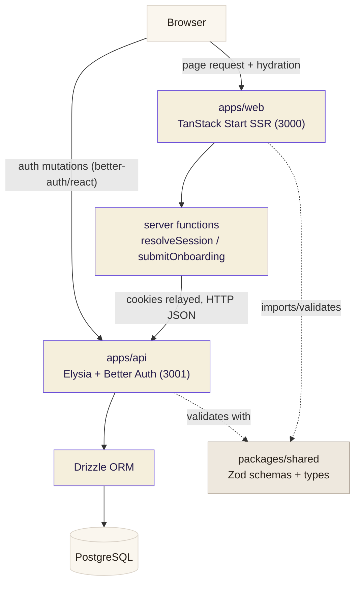

# Verselab Architecture

Verselab is a **Bun workspace monorepo** for a gamified interactive-learning web app. The web app is a TanStack Start SSR app rendered from the TanStack Router route tree. It hydrates React features in the browser, relays sessions through TanStack Start server functions, and talks to a separate Elysia API for accounts, profiles, and learning data. The API uses Better Auth for authentication, feature controllers under `/v1`, and lazy Drizzle/PostgreSQL access. Shared Zod schemas live in `packages/shared`.

Read [PRD.md](PRD.md) for _what_ the product is, [CONCEPT.md](CONCEPT.md) for the learning-engine ideas, and this document for _how_ the code is organized and why. [AGENTS.md](AGENTS.md) is the operational guide (commands, conventions).

Related files:

- `apps/api/.env.example` / `apps/web/.env.example` — environment variable templates (see [DEVELOPMENT.md](DEVELOPMENT.md))
- `apps/api/drizzle/` — Drizzle migrations
- `docs/backend-refactor.md` — step-by-step backend refactor plan (target architecture)

## Current system map



## Workspace shape

```txt
apps/
  api/       Bun + Elysia + Better Auth + Drizzle/PostgreSQL API
  web/       TanStack Start + React 19 SSR frontend
packages/
  shared/    shared Zod schemas/types (single source of truth for DTOs)
```

There is no `packages/ui` — web owns its shadcn/ui primitives under `apps/web/src/components/ui/`, and all Storybook lives in `apps/web`.

## Runtime responsibilities

### `apps/web`

`apps/web` owns the user interface, the learning engine, and SSR rendering.

Stack:

- TanStack Start / TanStack Router
- React 19
- Vite (dev + build)
- Tailwind CSS v4 + shadcn/ui
- Zustand (client state, persisted to `localStorage`)
- Better Auth React client (`better-auth/react`)
- Vitest + Testing Library

Responsibilities:

- routes under `src/routes` (thin, delegate to features)
- the **engine/domain split** — the core architectural rule (see below)
- feature modules under `src/features/`
- curriculum data under `src/content/`
- session relay + auth guards via TanStack Start server functions (`src/libs/session.ts`)
- client auth mutations through `src/libs/auth-client.ts`
- app-side Storybook stories (`src/stories`, `apps/web/.storybook`)

It should **not** own:

- database logic or business persistence logic
- Elysia/Better Auth server logic
- duplicated DTO schemas (use `packages/shared`)

Web data flow:

```txt
route loader / beforeLoad
  -> resolveSession() server fn (relays cookies)
  -> authClient.getSession / fetch(`${apiOrigin}/v1/...`)
  -> apps/api Elysia route
```

Server functions (`createServerFn`) are used only where the web server itself owns something: cookie relay to/from the API, session resolution for route guards, and the `submitOnboarding` POST. Normal product data that grows in the future should go through the API.

### `apps/api`

`apps/api` owns the backend HTTP API, auth, validation, logging, and persistence.

Stack:

- Bun + Elysia
- Better Auth (mounted at `/api/auth/*`)
- Drizzle ORM + `pg`
- PostgreSQL (local Docker on port 5432)
- shared Zod schemas from `@verselab/shared`

Responsibilities:

- HTTP routes under `/v1/*`: `health`, `user`, `onboarding`
- Better Auth endpoint handling (`/api/auth/*`)
- request/response validation with shared Zod schemas
- database queries through lazy `getDb()`
- response helpers `ok()` / `fail()`
- request logging/tracing (`plugins/logger.ts`)
- CORS for the web origin

It should **not** own:

- frontend UI state or the learning engine
- duplicated frontend schemas

Feature module shape (current):

```txt
apps/api/src/modules/<feature>/
  index.ts   Elysia controller
```

Target shape (from `docs/backend-refactor.md`):

```txt
apps/api/src/modules/<feature>/
  index.ts   Elysia controller (happy path only, factory for DI)
  service.ts business logic (framework-decoupled)
```

### `packages/shared`

`packages/shared` owns schemas and types reused by both API and web.

```txt
packages/shared/src/schemas/
  profile.ts   unitIdSchema, dailyGoalSchema, onboardingSchema, profileSchema
```

Rules:

- Zod schemas are the source of truth for JSON DTOs.
- Export schema and inferred type together (e.g. `OnboardingInput`, `Profile`, `DailyGoal`).
- API uses schema for Elysia `body` validation.
- Web uses schema for form validation and DTO types.
- Do not duplicate DTO definitions in app packages.

## Engine / domain split

The single most important rule in `apps/web` (PRD §3.2). The codebase is deliberately divided into two halves:

- **`engine/`** — subject-agnostic: lesson player, progress (XP/streak/mastery/daily goal), path/next-lesson logic, and the `Screen`/`Lesson`/`Unit` type definitions. It must never know what the material is about.
- **`domains/`** — the material. Today only `personal-finance/` (math + screen renderers). Future domains become sibling folders.

The engine passes one screen's data to the domain; the domain renders it and calls back `onAnswer(true)` or `onAnswer(false)`. Auth/onboarding live in the API and in `features/auth` / `features/onboarding`; they never reference subject matter either.

## Request lifecycle

### Web SSR page request

```txt
Browser requests http://localhost:3000/route
  -> TanStack Start SSR renders route
  -> beforeLoad may call resolveSession() (server fn)
  -> server fn forwards browser cookies to API
  -> Better Auth getSession + /v1/user/me return JSON
  -> Start renders HTML with the resolved session
  -> Browser hydrates React + session context
```

### Browser auth mutation

```txt
Browser form submit (login/register/reset/forgot)
  -> React form validates with shared Zod schema (features/auth/schemas.ts)
  -> authClient.signIn.email / signUp.email / requestPasswordReset / resetPassword
  -> better-auth/react calls http://localhost:3001/api/auth/* (CORS + credentials)
  -> Better Auth writes session cookies on the API origin
  -> web route guards re-resolve the session via server functions
  -> router redirects (dashboard, onboarding, etc.)
```

### API request

```txt
Request enters Elysia
  -> logger plugin adds x-request-id
  -> CORS checks origin
  -> route validation runs (shared Zod body)
  -> auth macro validates session when { auth: true }
  -> controller calls service (target: service uses getDb())
  -> response returned via ok()/fail()
```

### API error

```txt
Elysia error
  -> global onError (logger plugin) maps to friendly JSON
  -> response includes requestId + error code
```

Current error handling is a mix of `fail()` returns in controllers and a generic `onError` in the logger plugin. The refactor plan (`docs/backend-refactor.md`) targets the wedding-tools model: typed `AppError` + centralized `appErrorMeta` + a global `onError` mapping, with controllers happy-path only.

Response envelope:

```json
{ "ok": true, "data": { ... } }
{ "ok": false, "error": { "code": "...", "message": "..." } }
```

Use the helpers in `apps/api/src/libs/response.ts`:

```ts
ok(data); // { ok: true, data }
fail({ code, message }); // { ok: false, error: { code, message } }
```

## Data and schema flow

```txt
packages/shared Zod schema
  |---------------------------|
  v                           v
API route validation          Web form / DTO types
Elysia body (onboardingSchema)  react-hook-form + zodResolver
```

For normal JSON DTOs, use shared Zod. `features/auth/schemas.ts` holds web-native auth form schemas (email/password) that mirror the API rules.

## Database architecture

Drizzle schema files:

```txt
apps/api/src/database/schema.ts        # user_profiles, daily_goal enum
apps/api/src/database/auth-schema.ts   # Better Auth: user, session, account, verification
```

`getDb()` (`apps/api/src/database/index.ts`) is lazy by design:

- tests can import the API without `DATABASE_URL`
- the connection initializes only when a service actually queries

Migration commands:

```sh
bun run --cwd apps/api db:generate
bun run --cwd apps/api db:migrate
bun run --cwd apps/api db:push
bun run --cwd apps/api db:studio
```

See [DATABASE-SCHEMA.md](DATABASE-SCHEMA.md) for the full data model.

## Auth

Auth is owned by **Better Auth** (`apps/api/src/auth/index.ts`), mounted inside Elysia at `/api/auth/*`:

- email + password enabled; email verification disabled
- sessions persist in the PostgreSQL `session` table
- `plugin`-style `authContext` macro (`apps/api/src/middleware/auth.ts`) resolves the session and guards routes with `{ auth: true }`
- `BETTER_AUTH_SECRET`, `BETTER_AUTH_URL`, `WEB_ORIGIN` come from `config/env.ts` (Zod-parsed)

The web app relays sessions through server functions (`apps/web/src/libs/session.ts`: `resolveSession` / `requireAuth`) and authenticates from the browser via `apps/web/src/libs/auth-client.ts`.

## Logging and tracing

Logger plugin: `apps/api/src/plugins/logger.ts`

- adds `x-request-id` on every request
- logs requests and errors (readable in dev, JSON in production)
- silences logs in tests
- maps unexpected 5xx errors to a friendly JSON envelope

## Storybook

Storybook lives in `apps/web` only:

```txt
apps/web/.storybook   @storybook/tanstack-react config
apps/web/src/stories  stories (features + shadcn primitives)
```

- Port `6006`
- Do not place stories beside component source; keep them in `apps/web/src/stories`

## Deployment and build outputs

### Development

```txt
local Bun web (3000) + local Bun API (3001)
  -> Docker PostgreSQL (verselab-postgres, 5432)
```

Commands:

```sh
docker start verselab-postgres
bun run dev:api        # API on 3001
bun run dev            # web on 3000
```

### Production

Not yet configured. Web builds with Vite (`bun run build` → `apps/web/dist`); the API runs directly from source with Bun (`bun run --cwd apps/api start`). CORS restricts the API to `WEB_ORIGIN`.

## Testing strategy

Web tests live in `apps/web/tests` (Vitest + jsdom, mirrors `src/`).

API tests use `bun test tests/` with `app.handle(new Request(...))` — no test starts a real listener. Target tests (from the refactor plan):

- response status + JSON envelope
- validation messages
- request-id behavior
- controller/service boundaries through injected fakes (controller factories)

## Out of scope / future notes

Good next additions (see [docs/backend-refactor.md](docs/backend-refactor.md)):

- `AppError` + `appErrorMeta` + global `onError` mapping
- controller factories + service layer for `user` / `onboarding` / `health`
- `/v1/user/me` returning `{ user, profile }` (currently returns `{ user, session }` — spec gap)
- cookie `Set-Cookie` copying in web server functions (full relay per [docs/auth-web.md](docs/auth-web.md))
- API integration tests + OpenAPI plugin
- email delivery for forgot/reset-password flows

Avoid:

- duplicating schemas between apps
- adding ESLint/Prettier beside Oxlint/Oxfmt
- proxying every API request through `createServerFn`
- breaking the engine/domain split
- putting backend/database logic in `web/src/features/`
